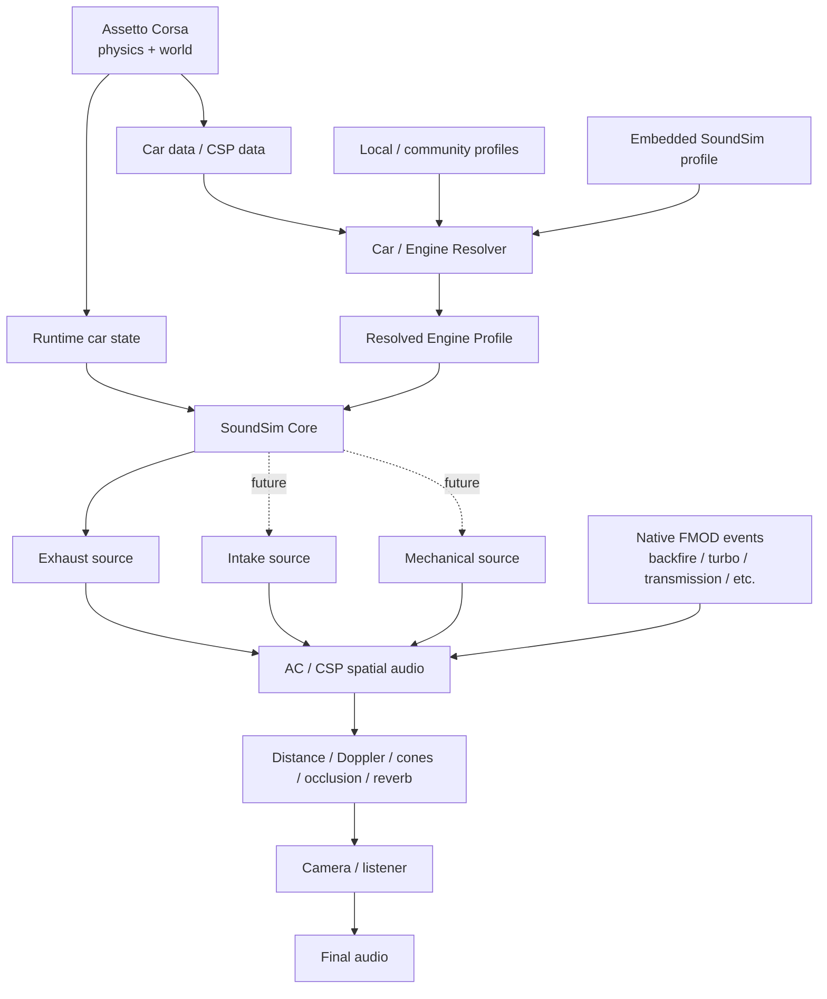
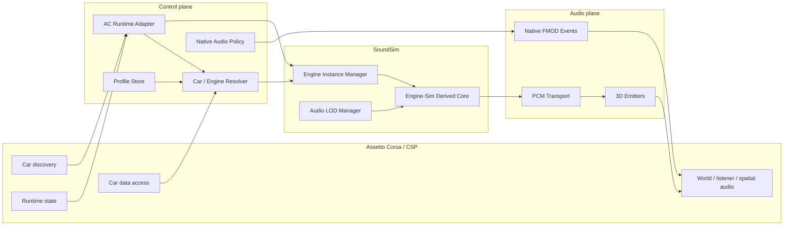
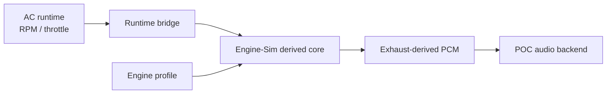
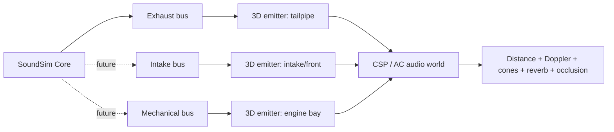

# AC SoundSim — Architecture technique de référence

> **Projet** : Sound simulation data-driven pour Assetto Corsa  
> **Base acoustique** : fork de `ange-yaghi/engine-sim`  
> **Intégration cible** : Assetto Corsa + Custom Shaders Patch (CSP)  
> **Statut** : M0–M4 implémentés ; base cabine/extérieur acceptée ; M5 ouverte  
> **Dernière consolidation** : 2026-10-02

---

## État consolidé après audit externe

Le détail ci-dessous conserve des décisions historiques et des éléments cibles
non implémentés. L'état exécutable actuel est dans `implementation-plan.md` et
`CODEX_HANDOFF.md`. Le YAML FA20 est maintenant chargé au démarrage pour identité,
géométrie, defaults et DSP source ; le résolveur voiture et beaucoup de paramètres
physiques restent spécialisés en C++. Voir `profile-extraction.md`.

EngineInt/EngineExt sont supprimés par gain réversible uniquement lorsque le
stream SoundSim est utilisable ; tous les autres événements FMOD restent intacts.
Cela ne prouve pas que le calcul natif soit évité ni que les événements moteur
de tous les mods ne contiennent que du continu. Un seul bus mono échappement ;
l'admission indépendante reste future. La base cabine/extérieur est acceptée,
mais M5 est divisée en M5A dynamique, M5B propagation, M5C mix, M5D latence/
robustesse. Le doublon d'allumage90Hz a été prouvé/corrigé par un adaptateur de
croisement phase+avance et identité cylindre/cycle, sans lissage RPM ni changement
gaz/DSP. Gate source multi-cadences strict, mesures QPC/loopback opt-in préparées.
Les quatre blocs ne sont pas encore PASS natifs : voir `m5-validation.md`.
Aucun renderer audio CI ne remplace les essais natifs CSP.

## 0. Résumé exécutif

Le projet vise à remplacer **uniquement la composante moteur continue** d’Assetto Corsa par une synthèse issue d’Engine-Sim, tout en conservant Assetto Corsa comme source de vérité physique et en réutilisant les événements natifs/FM0D pertinents.

Le principe directeur est :

```text
ASSETTO CORSA
= physique + état des voitures + monde 3D

SOUNDSIM
= acoustique moteur produite à la source

CSP / AC AUDIO
= propagation spatiale dans le monde

FMOD / événements natifs
= sons événementiels complémentaires
```

La cible finale n’est donc pas un simple « remplacement de banque FMOD », mais un pipeline hybride et data-driven :



### Décision de préparation

M0 a été confirmé par l’utilisateur le 2026-10-02. M1 fonctionne offline avec cinématique imposée et gaz/combustion/PCM upstream. M2 lit les états AC live par MMF et M3 transmet le PCM au stream CSP 3D selon le producteur Mumble officiel. Régime/crank concordants et source valid/playing observés en GT86 ; transport de sortie confirmé par tonalité de diagnostic mesurée en A/B. Voir `docs/m1-headless.md`, `docs/m2-m3-live.md` et `docs/research/csp-stream-format.md`. M4 mute natif et M5 écoute/fly-by/latence restent à faire.

État des anciens P0 au démarrage du développement :

1. **PCM temps réel → CSP : API et transport confirmés.** Le SDK expose `stream = {name, size}`. Le producteur MMF est maintenant implémenté depuis le code Mumble officiel et vérifié en sortie par test tonalité A/B ; la qualification complète en mouvement reste M5.
2. **Mute moteur natif : solution fonctionnelle connue, optimisation restante.** `engine_int` / `engine_ext` peuvent être neutralisés séparément; il reste à déterminer si un vrai stop/bypass permet d’éviter le coût de traitement plutôt qu’un simple gain nul.
3. **Multi/traffic : non bloquant pour le vertical slice.** La disponibilité/cadence des états distants devient un sujet de validation LOD/online ultérieur.
4. **RPM externe Engine-Sim : M1 offline et M2 live.** L’adaptateur impose la cinématique sur une horloge fixe ; aucun solveur véhicule/transmission ne contrôle le régime. Les états GT86 live sont raccordés par IPC.

---

# 1. Objectifs et périmètre

## 1.1 Objectif principal

Produire un son moteur continu à partir :

- de la géométrie moteur ;
- de l’ordre d’allumage ;
- des événements de combustion ;
- des flux et pulsations d’échappement ;
- de l’état moteur fourni par Assetto Corsa.

Le résultat doit suivre directement :

```text
RPM(t)
throttle(t)
load(t)
boost(t)
```

sans utiliser des couches de samples RPM comme source principale du moteur.

---

## 1.2 Ce que SoundSim remplace

Cible principale :

```text
engine_int
engine_ext
```

Éventuellement, à terme :

```text
limiter
certaines composantes de backfire
admission
mécanique moteur
turbo acoustique synthétique
```

---

## 1.3 Ce que SoundSim ne remplace pas par défaut

Les événements existants de qualité doivent rester réutilisables :

```text
backfire_ext
backfire_int
turbo / spool
BOV / flutter
transmission
gear_ext
gear_int
wheel / tyres
wind
collision
body noises
traction control
```

Politique par événement :

```yaml
audio:
  engine_int: soundsim
  engine_ext: soundsim

  turbo: native
  backfire: native
  transmission: native
  gear: native

  limiter: hybrid
```

Valeurs possibles :

```text
soundsim
native
hybrid
disabled
```

---

## 1.4 Non-objectifs initiaux

Le MVP ne doit pas chercher à :

- remplacer toute la physique moteur d’AC ;
- simuler la dynamique véhicule ;
- extraire les samples des banques FMOD ;
- reproduire immédiatement un silencieux complexe ;
- simuler toutes les voitures d’un serveur traffic en haute qualité ;
- résoudre dès la première version toute l’acoustique géométrique du circuit.

---

# 2. Contraintes de conception

## 2.1 Assetto Corsa reste la source de vérité physique

AC conserve :

```text
RPM
couple / puissance
transmission
clutch
gearbox
wheel physics
vehicle speed
boost physique
aides
état du véhicule
```

SoundSim consomme ces données.

Il ne doit pas recalculer un RPM concurrent.

---

## 2.2 Pas de méthode intrusive

L’architecture doit privilégier :

- API CSP documentées ;
- shared memory officielle AC ;
- données normales de la voiture ;
- `ac.INIConfig.carData()` ;
- profils locaux ;
- configuration CSP.

À éviter :

```text
memory scanning
patching arbitraire
extraction forcée de banques FMOD
décryptage non nécessaire
hook non documenté
modification de la physique online
```

---

## 2.3 Séparation « émission / propagation »

SoundSim répond uniquement à :

> **Quel son cette mécanique produit-elle à la source ?**

AC/CSP répond à :

> **Comment ce son arrive-t-il à la caméra/listener ?**

Cela signifie que SoundSim ne doit pas intégrer lui-même :

```text
Doppler lié au déplacement dans le monde
distance listener/source
track reverb
tunnel reverb
occlusion par bâtiments
position de caméra
fly-by artificiel
```

Le fly-by doit émerger naturellement de la spatialisation.

---

# 3. État réel de la base Engine-Sim

## 3.1 Base retenue

Dépôt :

```text
https://github.com/ange-yaghi/engine-sim
```

Licence :

```text
MIT
```

Le projet construit déjà son cœur sous forme de bibliothèque statique `engine-sim` et utilise C++17.

Dépendances historiques principales :

```text
SDL2
SDL2_image
Boost
Flex / Bison
GoogleTest
```

Le fork SoundSim devra progressivement isoler le sous-ensemble acoustique nécessaire.

---

## 3.2 Ce que le synthétiseur fait réellement aujourd’hui

Point important : le code open-source actuel **ne possède pas déjà trois sorties séparées admission / mécanique / échappement**.

`PistonEngineSimulator::writeToSynthesizer()` produit des valeurs issues des pressions/flux d’échappement, regroupées par système d’échappement, puis les envoie au `Synthesizer`.

Pipeline actuel simplifié :

```text
cylinders
   ↓
exhaust runner / primary pressure
   ↓
delay per cylinder
   ↓
exhaust-system channel(s)
   ↓
per-channel filtering / convolution
   ↓
sum
   ↓
mono PCM output
```

Le synthétiseur :

- accepte plusieurs canaux d’entrée ;
- applique une convolution par canal ;
- somme les canaux ;
- produit un signal mono ;
- utilise `int16_t` en sortie ;
- a une configuration par défaut à 44,1 kHz ;
- possède son propre thread de rendu et des buffers internes.

### Conséquence

Pour le MVP :

```text
SoundSim output = exhaust-oriented engine source
```

Les sources :

```text
intake
mechanical
```

sont **des développements futurs**, ou peuvent rester temporairement sous forme d’événements natifs/FM0D.

---

## 3.3 Ce qui peut être retiré ou bypassé

Le backend audio ne devrait pas dépendre durablement de :

```text
vehicle dynamics
drag simulation
full transmission dynamics
vehicle acceleration
dyno UI
game UI
Discord integration
video output
```

---

## 3.4 Ce qui doit être conservé / réutilisé

Priorité :

```text
engine geometry
crankshaft / firing phase
ignition
combustion chambers
gas system
cylinder head
exhaust runners
exhaust systems
delay filters
impulse responses
convolution
synthesizer concepts
audio buffers
```

---

# 4. Architecture logique

## 4.1 Vue générale



---

## 4.2 Deux plans distincts

### Control plane

Faible volume de données, fréquence relativement basse :

```text
car identity
profile selection
engine configuration
audio policy
LOD state
errors / diagnostics
```

### Audio / realtime plane

Fréquence élevée et contraintes temps réel :

```text
RPM
throttle
boost/load
phase progression
PCM blocks
emitter transforms
velocity
```

Ces deux plans ne doivent pas partager naïvement des locks bloquants.

---

# 5. Modules

## 5.1 `AcRuntimeAdapter`

Responsabilités :

- détecter les voitures ;
- fournir leur `car_id` ;
- fournir les données runtime ;
- lire les données AC accessibles ;
- dater les états ;
- signaler spawn/despawn/reset/session change.

Interface logique :

```cpp
struct RuntimeCarState {
    uint32_t carIndex;
    std::string carId;

    double timestamp;

    float rpm;
    float throttle;
    float clutch;
    float boost;

    int gear;

    Vec3 position;
    Vec3 velocity;

    bool active;
    bool playerCar;
    bool aiControlled;
};
```

Les champs exacts devront être adaptés à ce que CSP expose réellement pour chaque type de voiture.

---

## 5.2 `CarEngineResolver`

Responsabilités :

```text
Car ID
↓
embedded SoundSim profile
↓
local/community car profile
↓
known engine family
↓
AC/CSP inference
↓
generic fallback
```

Il doit produire un `ResolvedEngineProfile`.

---

## 5.3 `ProfileStore`

Organisation proposée :

```text
profiles/
├── cars/
│   ├── ks_toyota_gt86.yaml
│   └── ...
│
├── engines/
│   ├── subaru_fa20.yaml
│   └── ...
│
└── fallbacks/
    ├── i4_na.yaml
    ├── v6_na.yaml
    └── ...
```

---

## 5.4 `SoundSimCore`

Bibliothèque C++ indépendante d’Assetto Corsa.

Entrées :

```text
ResolvedEngineProfile
RuntimeEngineState
dt / timebase
```

Sortie MVP :

```text
exhaust-oriented mono PCM
```

Sorties cibles futures :

```text
exhaust
intake
mechanical
```

Interface conceptuelle :

```cpp
struct RuntimeEngineState {
    float rpm;
    float throttle;
    float load;
    float boost;
};

class SoundSimInstance {
public:
    void configure(const EngineProfile&);
    void updateState(const RuntimeEngineState&, double timestamp);
    AudioBlock render(uint32_t frames);
};
```

---

## 5.5 `AudioTransport`

Couche abstraite indispensable pour ne pas coupler le cœur au mode d’intégration.

```cpp
class IAudioSink {
public:
    virtual AudioFormat format() const = 0;
    virtual void submit(const AudioBlock&) = 0;
};
```

Backends envisagés :

```text
External WASAPI / SDL backend        -> POC
CSP / AC spatial backend             -> cible
possible native bridge backend       -> à déterminer
```

---

## 5.6 `NativeEventPolicy`

Détermine les événements natifs conservés ou neutralisés.

Décision confirmée le 2026-10-02 : tout événement FMOD non explicitement remplacé
est conservé avec son niveau d'origine, y compris ceux des autres mods. On ajuste
le niveau de **notre sortie SoundSim** au mix existant, sans équilibrer les FX un
par un. Le flutter, les détonations et d'autres effets qualitatifs peuvent rester
des samples. La liste ci-dessous est un exemple, pas une liste limitative de sons
à conserver. Voir [politique de mix hybride](hybrid-mix-policy.md).

Attention : un événement EngineInt/Ext qui contient aussi un effet à conserver
ne peut pas être découpé par une simple coupure de son volume global. Ce cas
nécessite une intégration adaptée à la voiture/mod ; pas de compatibilité
universelle implicite.

Exemple :

```yaml
native_audio_policy:
  engine_int: mute
  engine_ext: mute

  turbo: keep
  backfire_int: keep
  backfire_ext: keep
  transmission: keep
  gear_int: keep
  gear_ext: keep
```

---

## 5.7 `AudioLODManager`

Pour multi / traffic :

```text
distance
audibility
camera relevance
occlusion
vehicle priority
CPU budget
```

→ choix d’un niveau de qualité.

Exemple conceptuel :

```text
LOD0 — full
LOD1 — reduced
LOD2 — lightweight
LOD3 — native fallback / culled
```

Les distances exactes ne doivent pas être figées avant benchmark.

---

## 5.8 `Diagnostics`

Indispensable dès le début.

Exemple :

```text
Car ID            : ks_toyota_gt86
Profile           : cars/ks_toyota_gt86.yaml
Engine            : subaru_fa20
Resolver confidence: exact-car

RPM source        : CSP runtime
Redline source    : engine.ini
Firing order      : engine profile

Native engine     : muted
Backfire          : native
Turbo             : native

SoundSim latency  : ...
PCM underruns     : ...
LOD               : 0
```

---

# 6. Identification et lecture des données AC

## 6.1 Détection des voitures

CSP fournit des primitives de type :

```text
ac.getCar(...)
ac.iterateCars(...)
ac.getCarID(...)
```

Le `StateCar` expose aussi un helper `id()` basé sur `ac.getCarID()`.

C’est la base du resolver.

---

## 6.2 Lecture des fichiers de voiture

CSP expose :

```lua
ac.INIConfig.carData(carIndex, 'engine.ini')
```

Cette API indique explicitement supporter les fichiers `data.acd`.

Conséquence :

> le resolver peut lire les données de physique sans extraire manuellement le `data.acd`.

Exemples :

```text
engine.ini
drivetrain.ini
sounds.ini
power.lut
turbo data
```

---

## 6.3 Données qui restent hors du modèle AC standard

AC n’a pas besoin de connaître obligatoirement :

```text
cylinder count
engine layout
V angle
firing order
cross-plane / flat-plane
bore
stroke
rod length
header geometry
muffler geometry
```

Ces informations doivent venir :

```text
profil embarqué
ou
base communautaire
ou
inférence prudente
```

---

# 7. Format de profil

## 7.1 Profil moteur

```yaml
format: soundsim-engine
version: 1

identity:
  id: subaru_fa20
  manufacturer: Subaru
  family: FA
  code: FA20

geometry:
  layout: boxer
  cylinders: 4
  displacement_cc: 1998
  bore_mm: 86
  stroke_mm: 86

crankshaft:
  firing_order: [1, 3, 2, 4]

aspiration:
  type: naturally_aspirated

defaults:
  idle_rpm: 700
  redline_rpm: 7400
```

---

## 7.2 Profil voiture

```yaml
format: soundsim-car
version: 1

identity:
  car_id: ks_toyota_gt86

engine:
  profile: subaru_fa20

runtime:
  idle_rpm: auto
  redline_rpm: auto
  torque_curve: auto
  boost: auto

audio:
  engine_int: soundsim
  engine_ext: soundsim

  turbo: native
  backfire: native
  transmission: native
  limiter: hybrid
```

`auto` signifie :

> préférer la valeur réellement fournie par AC/CSP pour cette voiture.

---

## 7.3 Provenance par champ

Le resolver ne doit pas seulement produire une valeur.

Il doit pouvoir dire d’où elle vient :

```yaml
resolved:
  redline_rpm:
    value: 7400
    source: ac.engine_ini
    confidence: exact

  firing_order:
    value: [1, 3, 2, 4]
    source: community.engine_profile
    confidence: curated
```

---

# 8. Pipeline audio

## 8.1 Pipeline MVP réel



Le premier POC peut sortir directement via :

```text
WASAPI
SDL audio
ou autre backend Windows simple
```

---

## 8.2 Pipeline cible



---

## 8.3 Pourquoi CSP est très intéressant pour la cible

L’API publique `ac.AudioEvent` possède notamment :

```text
position
orientation
velocity
volume
pitch
distance min/max
3D cone settings
FMOD parameters
DSP parameter access
reverb response option
```

Cela correspond exactement aux besoins d’un émetteur spatial.

### Verrou

L’interface publique vérifiée expose des événements basés sur :

```text
FMOD soundbank events
audio files
groups
```

Le SDK installé testé expose également `stream = {name, size}` pour alimenter l’AudioEvent depuis un memory-mapped file.

Le protocole producteur est maintenant implémenté depuis le code Mumble officiel de CSP ; le transport 3D est accepté en session et sa sortie confirmée par mesure A/B d’une tonalité de diagnostic. Restent la qualification écoute/spatiale en mouvement et la latence ; aucun curseur consommateur, fill ou compteur underrun n’est inventé. Voir `docs/research/csp-stream-format.md`.

---

# 9. Temps réel, audio et synchronisation

## 9.1 Fréquences distinctes

Il faut distinguer :

```text
telemetry update rate
engine simulation rate
audio sample rate
audio block rate
render/game frame rate
```

Aucun de ces clocks ne doit être supposé identique.

---

## 9.2 RPM externe

Le RPM d’AC est la vérité.

Le core doit intégrer la phase vilebrequin :

```text
rpm(t)
↓
angular velocity
↓
crank phase
↓
firing events
```

Il faut prévoir :

- interpolation entre états telemetry ;
- correction de dérive ;
- gestion reset/téléportation ;
- traitement du stall ;
- changement brutal de RPM ;
- replay / pause.

---

## 9.3 Audio format

Engine-Sim historique utilise notamment :

```text
default audio sample rate = 44100 Hz
int16 output
mono final mix
```

La cible SoundSim devrait probablement évoluer vers :

```text
float32 internal PCM
sample rate configurable
block-oriented API
```

Mais le sample rate final doit être fixé **après** validation du backend AC/CSP.

---

## 9.4 Règle temps réel

Dans un callback audio final :

```text
no file I/O
no parsing
no profile resolution
no dynamic allocation
no network request
no blocking lock
```

Le rendu doit consommer des états déjà préparés.

---

## 9.5 Transport POC

Si SoundSim reste externe pendant le prototype :

```text
CSP / AC state producer
↓
shared memory
↓
lock-free / SPSC state queue
↓
SoundSim process
↓
audio output
```

Une mémoire partagée ou un ring buffer est préférable à un protocole réseau pour les données haute fréquence locales.

---

# 10. Spatialisation, fly-by et environnement

## 10.1 Fly-by

Pas de fonction :

```text
enableFlyBy()
```

Le résultat doit émerger de :

```text
source position
source velocity
listener position
listener velocity
directivity
distance
Doppler
environment
```

---

## 10.2 Sources distinctes

Cible future :

```text
                    FRONT

                 intake ●

              ┌────────────┐
              │ engine  ●  │
              └────────────┘

                exhaust ●

                    REAR
```

Effet attendu :

```text
approche  -> admission/front plus perceptible
passage   -> mécanique/engine bay
éloignement -> échappement dominant
```

---

## 10.3 Tunnels et réverbération

Responsabilité AC/CSP :

```text
distance attenuation
Doppler
occlusion
reverb
environmental response
distance delay si disponible/configuré
```

SoundSim ne doit pas pré-appliquer ces effets.

---

# 11. Multi / traffic

## 11.1 Modèle par voiture

Architecture :

```text
Car 0 -> Resolver -> SoundSim instance / LOD
Car 1 -> Resolver -> SoundSim instance / LOD
Car 2 -> Resolver -> SoundSim instance / LOD
...
```

---

## 11.2 Intérêt de l’architecture spatiale

Pour un traffic server :

```text
arrivée par derrière
croisement
dépassement
voiture derrière un bâtiment
tunnel
distance
vitesse relative
```

ne nécessitent pas de logique spécifique SoundSim.

Le moteur produit une source.

Le monde AC/CSP gère le rendu.

---

## 11.3 LOD

Le LOD doit être conçu dès l’architecture, même si son implémentation vient plus tard.

Exemple conceptuel :

```text
LOD0
full engine acoustics

LOD1
reduced simulation rate / reduced detail

LOD2
simplified harmonic/pulse model

LOD3
native fallback or cull
```

Une transition de LOD doit être crossfadée pour ne pas cliquer.

---

# 12. Stack technique recommandée

## 12.1 Plateforme

```text
Windows x64
Assetto Corsa PC
Custom Shaders Patch
```

---

## 12.2 Core SoundSim

```text
Language       : C++17 initialement
Build          : CMake
Base           : ange-yaghi/engine-sim
Tests          : GoogleTest
```

Pourquoi C++17 au départ :

- upstream est déjà en C++17 ;
- minimise les changements pendant l’extraction du core ;
- migration C++20 possible après découplage.

---

## 12.3 Couche CSP

```text
Language       : Lua / LuaJIT CSP
SDK            : acc-lua-sdk
Role           : détection, données AC, orchestration, spatial/audio integration
```

Les définitions exactes de l’API doivent être prises depuis la version CSP minimale retenue dans :

```text
extension/internal/lua-sdk
```

---

## 12.4 Profils

Recommandation :

```text
Authoring format : YAML
Schema version   : explicite
Parser C++       : yaml-cpp ou équivalent
```

Le parseur final reste un choix d’implémentation secondaire.

---

## 12.5 IPC du prototype

Préférence :

```text
Windows shared memory
+
SPSC ring buffers / snapshots versionnés
```

Séparer :

```text
state/control messages
audio blocks
```

Le chemin audio final peut supprimer cet IPC s’il devient in-process.

---

## 12.6 Backend audio POC

Options acceptables :

```text
SDL2 audio
WASAPI
miniaudio/WASAPI
```

Le POC ne doit pas dicter le backend final.

---

## 12.7 CI / qualité

À préparer :

```text
GitHub Actions Windows
unit tests
profile schema tests
deterministic profile loading tests
basic audio regression fixtures
clang-format
static analysis optionnelle
```

---

# 13. Arborescence de repo cible

```text
ac-soundsim/
│
├── CMakeLists.txt
├── LICENSES/
├── README.md
│
├── core/
│   ├── engine/
│   ├── combustion/
│   ├── exhaust/
│   ├── synthesis/
│   └── realtime/
│
├── integration/
│   ├── ac/
│   │   ├── shared_memory/
│   │   └── protocol/
│   └── csp/
│       ├── lua/
│       └── config/
│
├── resolver/
│   ├── car/
│   ├── engine/
│   └── inference/
│
├── profiles/
│   ├── schema/
│   ├── cars/
│   ├── engines/
│   └── fallbacks/
│
├── audio/
│   ├── transport/
│   ├── sinks/
│   └── lod/
│
├── apps/
│   ├── soundsim-poc/
│   └── diagnostics/
│
├── tests/
│
└── docs/
    ├── architecture.md
    ├── profiles.md
    ├── protocol.md
    └── decisions/
```

---

# 14. Extension future : muffler / ligne détaillée

> **Hors MVP.**

L’Engine-Sim open-source ne possède pas de composant explicite de silencieux simulé comme un réseau acoustique détaillé.

Extension future :

```text
Cylinder
↓
Primary
↓
Collector
↓
Catalyst
↓
Resonator
↓
Muffler
↓
Tailpipe
```

Paramètres possibles :

```text
length
diameter
volume
flow resistance
reflection coefficient
frequency-dependent absorption
```

Exemple :

```yaml
muffler:
  type: absorption

  body:
    length_m: 0.45
    volume_l: 12

  inlet_diameter_mm: 63.5
  outlet_diameter_mm: 63.5

  absorption:
    low: 0.10
    mid: 0.55
    high: 0.85

  flow_resistance: 0.08
```

But :

```text
même moteur + échappement OEM
!=
même moteur + straight pipe
```

sans devoir créer un autre moteur.

---

# 15. Risques architecturaux

## P0 — Bloquants

### R1 — Injection PCM temps réel dans AC/CSP

**Question :**

> Comment fournir un buffer PCM généré par SoundSim à une source audio 3D bénéficiant du pipeline AC/CSP ?

Ce qui est confirmé :

`ac.AudioEvent` sait gérer :

- position ;
- vitesse ;
- distance ;
- cône ;
- paramètres ;
- DSP ;
- événements FMOD / fichiers.

L’API `stream = {name, size}` et le contrat producteur sont désormais vérifiés. Ce qui reste à déterminer :

```text
consumer cursor / fill / underrun behavior / actual end-to-end latency
```

Le pipeline est implémenté en M3, accepté par CSP et vérifié en sortie via une tonalité de diagnostic A/B. Les tests d’écoute et de propagation en mouvement restent à qualifier en M5.

---

### R2 — Mute moteur natif universel

Il existe une configuration CSP de volume par catégories/événements côté voiture, mais il faut figer une méthode :

```text
runtime API
ou
overlay ext_config généré
ou
autre mécanisme supporté
```

Exigence :

```text
mute engine_int / engine_ext
keep backfire / turbo / transmission / tyres / etc.
```

---

### R3 — Données des voitures distantes / online

CSP sait itérer les voitures et les identifier.

Il faut mesurer, par voiture distante :

```text
RPM availability
throttle availability
gear
boost
velocity
position
update rate
network smoothing
replay behavior
```

Un traffic server ne peut fonctionner correctement en SoundSim complet si le RPM distant n’est pas suffisamment fiable.

---

### R4 — Mode Engine-Sim à RPM imposé

**État : fermé pour le spike offline M1.** L’adaptateur analytique conserve la phase, l’allumage et le pipeline combustion/gaz/échappement sans exécuter le solveur mécanique. Les tests vérifient également throttle, ignition, arrêt/reprise et répétabilité PCM. Le suivi des états AC live reste à intégrer en M2.

L’Engine-Sim original couple :

```text
engine mechanics
vehicle
transmission
simulation
audio
```

Il faut vérifier qu’on peut créer proprement :

```text
externally driven crank phase / RPM
+
combustion / gas / exhaust simulation
```

sans instabilité ni boucle de contrôle entre AC et Engine-Sim.

---

## P1 — Importants avant MVP complet

### R5 — Sample rate / format / latence

À figer :

```text
target sample rate
block size
float32 vs int16 boundary
resampling
maximum acceptable latency
underrun strategy
```

---

### R6 — Séparation des buses

Le core actuel produit principalement un rendu exhaust-oriented.

Pour la cible :

```text
exhaust
intake
mechanical
```

il faudra créer de nouvelles voies de synthèse.

Pour le MVP :

```text
exhaust = SoundSim
intake/mechanical = native or omitted
```

est acceptable.

---

### R7 — Charge CPU multi-car

À mesurer :

```text
1 instance
4 instances
10 instances
20+ instances
```

et déterminer les LOD nécessaires.

---

### R8 — Exactitude du resolver

Il faut constituer une matrice de voitures :

```text
Kunos stock
mod ouvert
mod data.acd
mod CSP complexe
turbo
NA
swap moteur
online
traffic
```

---

## P2 — Futur

```text
muffler physique
advanced resonators
mechanical bus
intake bus avancé
multi-exhaust spatialization
advanced acoustic reflections
community profile registry
automatic profile download
```

---

# 16. Spikes obligatoires avant développement produit

## Spike A — `CSP PCM Injection`

### But

Produire un signal PCM dynamique simple :

```text
tone generator
ou
petit flux SoundSim
```

et l’attacher à une voiture comme source 3D.

### À vérifier

```text
position
velocity
Doppler
distance attenuation
cone
camera changes
track camera
reverb
occlusion si possible
```

### PASS

Une API/support propre permet :

```text
live PCM
→ source 3D CSP/AC
```

sans patch mémoire ou extraction/hack.

### FAIL

Si aucune voie supportée n’existe :

choisir explicitement entre :

```text
A. demander/ajouter une API CSP supportée
B. backend audio externe avec spatialisation propre
C. extension native dédiée officiellement supportable
```

**Ne pas commencer le backend final avant cette décision.**

---

## Spike B — `AC Data Probe`

Créer un script CSP diagnostic qui dump pour chaque voiture :

```text
car index
car ID
name
position
velocity
RPM
throttle
gear
boost
clutch
AI/player/remote
timestamps
```

Tester :

```text
single player
AI race
track day
replay
online server
traffic server
```

### Livrable

Matrice :

| Champ | Joueur | IA | Online distant | Replay |
|---|---:|---:|---:|---:|
| Car ID | ? | ? | ? | ? |
| RPM | ? | ? | ? | ? |
| Throttle | ? | ? | ? | ? |
| Gear | ? | ? | ? | ? |
| Boost | ? | ? | ? | ? |
| Position | ? | ? | ? | ? |
| Velocity | ? | ? | ? | ? |

---

## Spike C — `Headless Engine-Sim`

### But

Compiler un exécutable minimal :

```text
hardcoded engine profile
+
externally supplied RPM
+
throttle
↓
PCM output
```

Sans :

```text
UI
vehicle acceleration
drag
full transmission
```

### PASS

Le régime imposé par AC :

- reste stable ;
- conserve la phase ;
- produit des pulses cohérents ;
- suit les montées/descentes de régime ;
- ne dépend pas du véhicule Engine-Sim.

---

## Spike D — `Selective Native Audio Mute`

### But

Sur une voiture test :

```text
engine_int = 0
engine_ext = 0
```

tout en gardant :

```text
backfire
turbo
transmission
gear
tyres
wind
collision
```

### PASS

Le comportement est reproductible :

```text
Kunos car
+
mod car
```

sans modification destructive de la banque.

---

## Spike E — `Latency & CPU Harness`

### But

Mesurer :

```text
AC state timestamp
→ SoundSim state ingest
→ PCM generated
→ audio audible
```

et :

```text
CPU per engine instance
buffer underruns
jitter
```

Le budget chiffré sera défini à partir de cette mesure, pas inventé à l’avance.

---

# 17. Definition of Ready — avant développement principal

Le développement principal peut commencer lorsque les cases **P0** sont fermées.

## Architecture

- [ ] chemin PCM live → spatial audio choisi ;
- [ ] méthode de mute natif choisie ;
- [ ] rôle exact CSP vs processus C++ figé ;
- [ ] stratégie POC vs backend final documentée.

## Données

- [ ] matrice joueur/IA/online/replay réalisée ;
- [ ] sources de données AC prioritaires définies ;
- [ ] comportement si donnée absente défini ;
- [ ] format `EngineProfile v1` gelé pour le MVP ;
- [ ] format `RuntimeCarState v1` gelé.

## Core

- [ ] Engine-Sim compile dans le nouveau repo ;
- [ ] core headless fonctionnel ;
- [ ] RPM externe fonctionnel ;
- [ ] sortie PCM déterministe/stable ;
- [ ] dépendances inutiles identifiées.

## Audio

- [ ] sample rate cible choisi ;
- [ ] format PCM choisi ;
- [ ] block size choisi ;
- [ ] stratégie underrun choisie ;
- [ ] transition session/reset testée.

## Compatibilité

- [ ] version minimale CSP définie ;
- [ ] une voiture Kunos testée ;
- [ ] une voiture mod `data.acd` testée ;
- [ ] comportement online décidé ;
- [ ] aucune modification de physique nécessaire.

## Juridique / distribution

- [ ] licence MIT Engine-Sim conservée ;
- [ ] notices tierces listées ;
- [ ] aucune banque FMOD distribuée ou extraite ;
- [ ] politique de profils communautaires définie.

---

# 18. Ce qui peut commencer immédiatement

Même avant de fermer tous les P0, on peut commencer sans risque architectural majeur :

```text
repo scaffold
CMake cleanup
license inventory
profile schema
resolver interfaces
diagnostic CSP script
AC data probe
Engine-Sim headless spike
unit tests
documentation
```

À ne pas figer avant le Spike A :

```text
final audio backend
PCM transport final
CSP emitter implementation
final process topology
```

---

# 19. Roadmap consolidée

## Phase 0 — Technical feasibility

```text
A. CSP PCM injection spike
B. AC data probe
C. Engine-Sim headless external-RPM
D. selective native audio mute
E. latency/CPU harness
```

## Phase 1 — Single-car POC

```text
one car
one engine profile
exhaust-oriented SoundSim output
external audio backend acceptable
diagnostics
```

Voiture candidate :

```text
Toyota GT86 / FA20
```

## Phase 2 — Resolver

```text
Car ID
engine.ini
power LUT
profile DB
auto overrides
provenance
fallbacks
```

## Phase 3 — Integrated 3D audio

```text
SoundSim PCM
→ AC/CSP 3D emitter
→ distance
→ Doppler
→ track cameras
→ reverb
```

## Phase 4 — Hybrid audio

```text
SoundSim engine
+
native backfire
+
native turbo
+
native transmission
```

## Phase 5 — Multi-car

```text
AI
online
traffic
instance manager
LOD
CPU budgets
```

## Phase 6 — Acoustic expansion

```text
intake bus
mechanical bus
multiple exhaust outlets
directivity refinement
```

## Phase 7 — Exhaust system v2

```text
catalyst
resonator
muffler
tailpipe
frequency-dependent absorption
```

## Phase 8 — Community format

```text
profile registry
validation
versioning
contributions
optional updater
```

---

# 20. Décisions architecturales enregistrées

## ADR-001 — AC reste maître du RPM

**Décision :** SoundSim ne recalcule pas le régime véhicule.

---

## ADR-002 — Pas de remplacement audio total

**Décision :** réutiliser les événements FMOD natifs utiles.

---

## ADR-003 — Pas d’extraction de banque

**Décision :** les `.bank` restent opaques et intactes.

---

## ADR-004 — Source generation != world propagation

**Décision :**

```text
SoundSim -> émission
AC/CSP -> propagation
```

---

## ADR-005 — Profil moteur séparé du profil voiture

**Décision :**

```text
car profile
→ engine family
→ per-car overrides
```

---

## ADR-006 — Multi/traffic prévu dès l’architecture

**Décision :** instance manager + LOD font partie du design de base.

---

## ADR-007 — Muffler détaillé après MVP

**Décision :** ne pas bloquer le POC sur une ligne d’échappement avancée.

---

## ADR-008 — Intake/mechanical ne sont pas considérés comme disponibles dans upstream

**Décision :** MVP exhaust-oriented ; buses supplémentaires développées ultérieurement.

---

# 21. Sources techniques vérifiées

## Engine-Sim

Repository :

https://github.com/ange-yaghi/engine-sim

Licence MIT :

https://github.com/ange-yaghi/engine-sim/blob/master/LICENSE

Build / bibliothèque C++17 :

https://github.com/ange-yaghi/engine-sim/blob/master/CMakeLists.txt

Synthesizer :

https://github.com/ange-yaghi/engine-sim/blob/master/src/synthesizer.cpp

Piston engine simulator / signal d’échappement :

https://github.com/ange-yaghi/engine-sim/blob/master/src/piston_engine_simulator.cpp

---

## CSP Lua SDK

Repository :

https://github.com/ac-custom-shaders-patch/acc-lua-sdk

Audio API :

https://github.com/ac-custom-shaders-patch/acc-lua-sdk/blob/main/lib_audio.lua

Car state / car iteration :

https://github.com/ac-custom-shaders-patch/acc-lua-sdk/blob/main/common/ac_state.lua

INI / `data.acd` access :

https://github.com/ac-custom-shaders-patch/acc-lua-sdk/blob/main/common/ac_extras_ini.lua

---

## FMOD spatial audio

Documentation FMOD :

https://www.fmod.com/docs/2.04/studio/advanced-topics.html

---

# 22. État de départ recommandé

Le prochain travail concret n’est pas de coder directement « le mod complet ».

Il faut lancer **deux branches de preuve de faisabilité en parallèle** :

```text
Track A — AC/CSP
    data probe
    PCM injection
    selective mute

Track B — Engine-Sim
    headless core
    external RPM
    PCM output
```

Le point de jonction est :

```text
RuntimeCarState
+
EngineProfile
↓
SoundSim
↓
PCM block
↓
AC/CSP 3D emitter
```

Quand ce chemin fonctionne pour **une seule voiture**, l’architecture est suffisamment validée pour passer au développement du resolver, de la base de profils, puis du multi/traffic.


---

# 23. Baseline de développement M0 — GT86 / FA20

Mise à jour du 2026-10-02 : M0 confirmé côté UI/états ; M1 validé offline ; M2/M3 implémentés et exercés en GT86. PCM réel envoyé à CSP et transport confirmé par test de sortie distinct. Logging bridge persisté dans `Documents/Assetto Corsa/logs/ac_soundsim_bridge.txt`. Voir `docs/m2-m3-live.md` pour preuves et limites ; mute natif et validation fly-by restent M4/M5.

Le développement commence par une tranche verticale volontairement limitée :

```text
ks_toyota_gt86
→ profil FA20 / 4U-GSE
→ runtime observé par CSP
→ logs déterministes
→ interfaces versionnées
→ Engine-Sim headless/external-RPM en M1
```

Artefacts M0 :

- `RuntimeCarStateV1` : frontière versionnée AC/CSP → SoundSim ;
- `EngineProfileV1` : profil moteur minimal ;
- profil `subaru_fa20.yaml` ;
- profil voiture `ks_toyota_gt86.yaml` ;
- logger C++ timestampé par sous-système ;
- app CSP `AC SoundSim Bridge` avec logs `[ACSoundSim]` ;
- bootstrap isolé d’Engine-Sim upstream ;
- ADR pour source/propagation, autorité RPM et cible GT86.

## Ordre strict des prochains jalons

```text
M0 observable baseline
↓
M1 Engine-Sim headless + externally-driven crank
↓
M2 RuntimeCarState via IPC/MMF
↓
M3 PCM live MMF → CSP 3D emitter
↓
M4 selective native-engine mute + hybrid native events
↓
M5 first driveable GT86/FA20 vertical slice
```

Règle de développement : chaque jalon doit produire des logs suffisants pour distinguer **absence de données**, **profil incorrect**, **erreur de simulation**, **underrun audio** et **erreur d’intégration CSP**.
